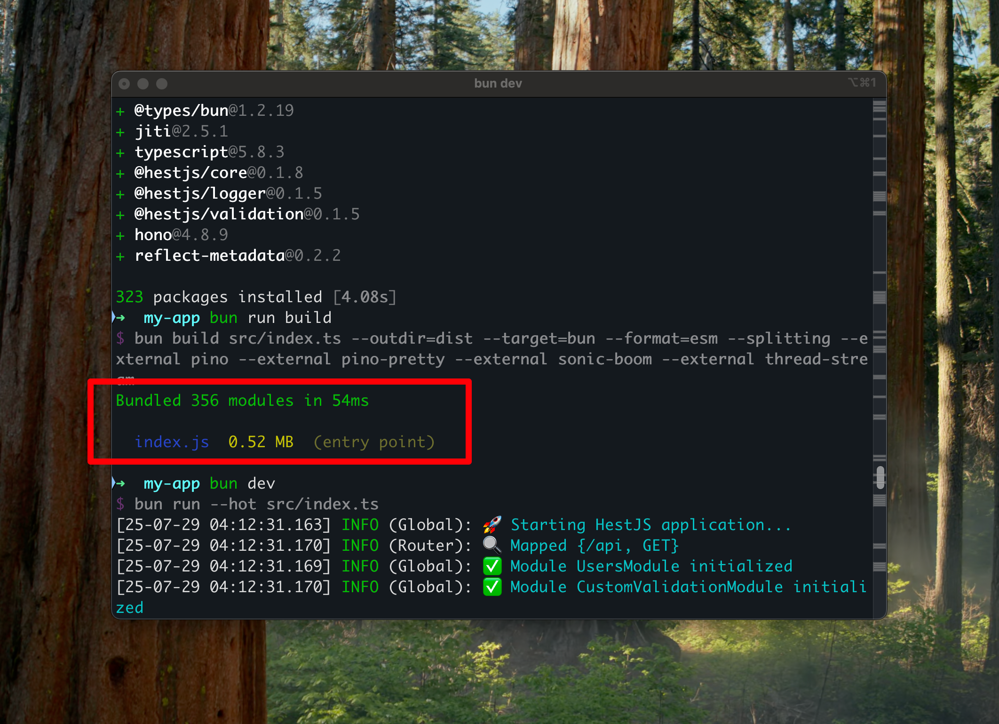
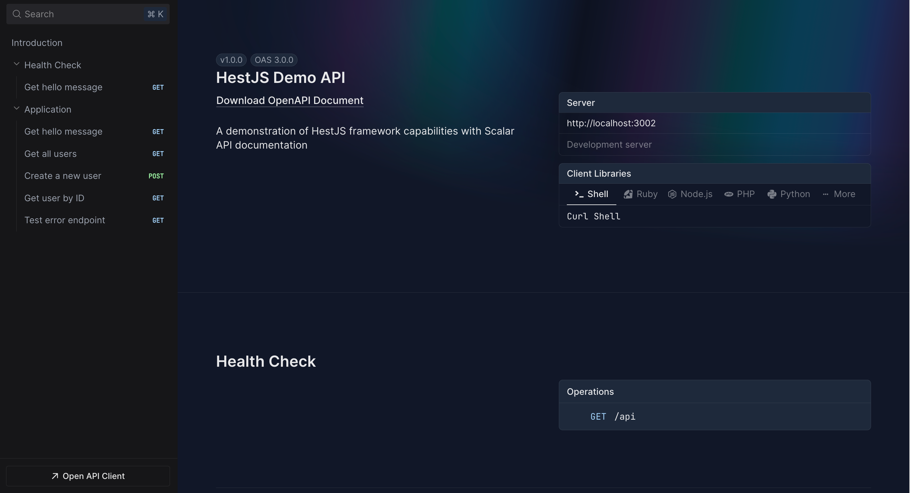

# HestJS 🚀

一个基于 **Hono + Bun + TSyringe** 的现代化 TypeScript 后端库，提供类似 NestJS 的开发体验，但具有更轻量、更高性能、不捆绑用户的特点。

**核心理念**：把选择权交给开发者，拒绝过度封装底层框架。HestJS 直接返回原生 Hono app 实例，让你能够使用 Hono 的所有原生功能，同时提供优雅的 OOP 范式（NestJS风格）和可选的增强功能。

[](https://www.typescriptlang.org/)
[](https://bun.sh/)
[](https://hono.dev/)
[](LICENSE)

## 🎯 核心亮点

### ⚡ 极速构建 - 仅需 54ms，产物仅 0.52MB



**突破性的构建速度**：得益于 Bun 的强大性能，HestJS 实现了业界领先的 54ms 构建速度，让开发体验更加流畅，你甚至可以边开发边构建！

### 🎨 精美的 API 文档界面



**专业级文档体验**：集成现代化的 Scalar 文档系统，提供精美、直观的 Swagger 文档界面，让 API 探索变得优雅高效。

---

## ✨ 核心特性

- 🎯 **优雅的 OOP 范式** - 装饰器驱动的面向对象开发体验
- 🔓 **原生底层访问** - 直接返回 Hono app 实例，无二次封装，保留所有原生功能
- ⚡ **极致性能** - 基于 Hono 和 Bun 的高性能运行时
- 💉 **轻量依赖注入** - 基于 TSyringe，简洁而强大
- 🏗️ **灵活模块化** - 按需组合，不强制架构约束
- 🛡️ **可选数据验证** - 需要时才引入验证系统
- 📚 **可选 API 文档** - 按需集成 OpenAPI 文档生成
- 🔄 **可选 CQRS 支持** - 复杂业务场景时的命令查询分离
- 📝 **可选日志系统** - 按需集成高性能日志

## 🚀 快速开始

### 创建新项目

使用官方脚手架创建新的 HestJS 应用：

```bash
# 交互式创建
npx create-hest-app@latest
# 或
bun create hest-app

# 直接指定项目名
npx create-hest-app@latest my-app
```

### 运行演示应用

如果你想运行这个演示应用：

```bash
# 安装依赖
bun install

# 启动开发服务器（极速启动，构建仅需 54ms）
bun run dev
```

应用启动后，你可以：

- 🌐 访问 `http://localhost:3002` 查看应用
- 📖 访问 `http://localhost:3002/docs` 体验精美的 API 文档界面（前提启用了Swagger）

## 📚 文档

完整的框架文档请访问：**https://aqz236.github.io/hestjs-demo**

## 🛠️ 技术栈

- **运行时**: Bun
- **Web 框架**: Hono
- **依赖注入**: TSyringe
- **验证**: TypeBox + @hestjs/validation
- **日志**: Pino + @hestjs/logger
- **API 文档**: Scalar + @hestjs/scalar
- **CQRS**: @hestjs/cqrs

## 📖 代码示例

### 直接访问 Hono App 实例

HestJS 不会封装底层框架，你可以直接访问原生 Hono app 来使用所有 Hono 功能：

```typescript
import { HestFactory } from '@hestjs/core';
import { cors } from 'hono/cors';
import { AppModule } from './app.module';

async function bootstrap() {
  const app = await HestFactory.create(AppModule);

  // 直接访问原生 Hono app 实例
  const honoApp = app.hono();

  // 使用 Hono 原生中间件
  honoApp.use(cors());

  // 添加 Hono 路由和中间件
  honoApp.use('/api/*', async (c, next) => {
    console.log(`${c.req.method} ${c.req.url}`);
    await next();
  });

  // 添加全局拦截器和异常过滤器
  app.useGlobalInterceptors(new ValidationInterceptor());
  app.useGlobalFilters(new HttpExceptionFilter());

  // 使用 Bun 的原生 serve
  Bun.serve({
    port: 3002,
    fetch: honoApp.fetch,
    reusePort: true,
  });
}
```

### 创建控制器

```typescript
import { Controller, Get, Post, Context } from '@hestjs/core';
import { Body } from '@hestjs/validation';
import { IsString, IsEmail, IsNumber, Min, Max } from '@hestjs/validation';
import type { HestContext } from '@hestjs/core';

export class CreateUserDto {
  @IsString({ minLength: 2, maxLength: 50 })
  name!: string;

  @IsEmail()
  email!: string;

  @IsNumber()
  @Min(0)
  @Max(120)
  age!: number;
}

@Controller('/users')
export class UsersController {
  constructor(private readonly usersService: UsersService) {}

  @Get('/')
  async getAllUsers() {
    return {
      success: true,
      data: this.usersService.findAll(),
      message: 'Users retrieved successfully',
    };
  }

  @Get('/:id')
  async getUser(@Context() c: HestContext) {
    const id = parseInt(c.req.param('id'));
    return this.usersService.findOne(id);
  }

  @Post('/')
  async create(@Body(CreateUserDto) createUserDto: CreateUserDto) {
    return this.usersService.create(createUserDto);
  }
}
```

### 创建服务

```typescript
import { injectable } from '@hestjs/core';

@injectable()
export class UsersService {
  private users = [
    { id: 1, name: 'John Doe', email: 'john@example.com', age: 30 },
  ];

  findAll() {
    return this.users;
  }

  findOne(id: number) {
    return this.users.find(user => user.id === id);
  }

  create(userData: CreateUserDto) {
    const newUser = {
      id: this.users.length + 1,
      ...userData,
    };
    this.users.push(newUser);
    return newUser;
  }
}
```

### 创建模块

```typescript
import { Module } from '@hestjs/core';
import { UsersController } from './users.controller';
import { UsersService } from './users.service';

@Module({
  controllers: [UsersController],
  providers: [UsersService],
  exports: [UsersService],
})
export class UsersModule {}
```

### 根模块

```typescript
import { Module } from '@hestjs/core';
import { AppController } from './app.controller';
import { AppService } from './app.service';
import { UsersModule } from './modules/users/users.module';

@Module({
  imports: [UsersModule],
  controllers: [AppController],
  providers: [AppService],
})
export class AppModule {}
```

## 🎯 可用装饰器

### 路由装饰器

- `@Controller(path?)` - 定义控制器和路径前缀
- `@Get(path?)` - GET 请求
- `@Post(path?)` - POST 请求
- `@Put(path?)` - PUT 请求
- `@Delete(path?)` - DELETE 请求
- `@Patch(path?)` - PATCH 请求

### 参数装饰器

- `@Context()` - 获取完整的 Hono Context 对象
- `@Body(dto?)` - 获取请求体（支持验证）
- `@Param(key?)` - 获取路径参数
- `@Query(key?)` - 获取查询参数
- `@Header(key?)` - 获取请求头
- `@Req()` - 获取请求对象
- `@Res()` - 获取响应对象

### 依赖注入装饰器

- `@injectable()` - 标记类为可注入
- `@Module(metadata)` - 定义模块

## 🧪 测试 API

### 创建用户

```bash
curl -X POST http://localhost:3002/users \
  -H "Content-Type: application/json" \
  -d '{
    "name": "Alice Johnson",
    "email": "alice@example.com",
    "age": 28
  }'
```

### 获取用户列表

```bash
curl http://localhost:3002/users
```

### 获取特定用户

```bash
curl http://localhost:3002/users/1
```

## 🔧 项目结构

```
src/
├── index.ts                    # 应用入口
├── app.module.ts              # 根模块
├── app.controller.ts          # 应用控制器
├── app.service.ts             # 应用服务
├── modules/                   # 功能模块
│   ├── users/                 # 用户模块
│   │   ├── users.controller.ts
│   │   ├── users.service.ts
│   │   ├── users.module.ts
│   │   └── dto/               # 数据传输对象
│   └── other-features/        # 其他功能模块
├── common/                    # 公共组件
│   ├── filters/               # 异常过滤器
│   ├── interceptors/          # 拦截器
│   ├── guards/                # 守卫
│   └── decorators/            # 自定义装饰器
└── config/                    # 配置文件
```

## 📋 可用脚本

```bash
# 开发模式（热重载）
bun run dev

# 构建项目
bun run build

# 启动生产服务器
bun run start

# 类型检查
bun run check-types
```

## 🔄 与 NestJS 的对比

| 特性            | HestJS   | NestJS          |
| --------------- | -------- | --------------- |
| 运行时          | Bun      | Node.js         |
| Web 框架        | Hono     | Express/Fastify |
| 启动速度        | 极快     | 较慢            |
| 内存占用        | 低       | 较高            |
| 构建产物        | 0.52MB   | 通常 > 10MB     |
| TypeScript 支持 | 原生     | 需要编译        |
| 依赖注入        | TSyringe | 自研            |
| 底层访问        | 完全开放 | 部分封装        |
| 学习曲线        | 平缓     | 陡峭            |
| 生态系统        | 新兴     | 成熟            |

## 💡 设计原则

1. **不封装底层框架** - 直接暴露 Hono 实例，保留所有原生功能
2. **可选增强** - 所有功能都是可选的，按需使用
3. **类型安全** - 完整的 TypeScript 支持和类型推导
4. **性能优先** - 基于 Bun 和 Hono，追求极致性能
5. **开发体验** - 熟悉的装饰器语法，平滑的学习曲线

## 🤝 贡献

欢迎提交 Issue 和 Pull Request！

## 📄 许可证

[MIT](LICENSE)

---

**文档地址**: https://aqz236.github.io/hestjs-demo
